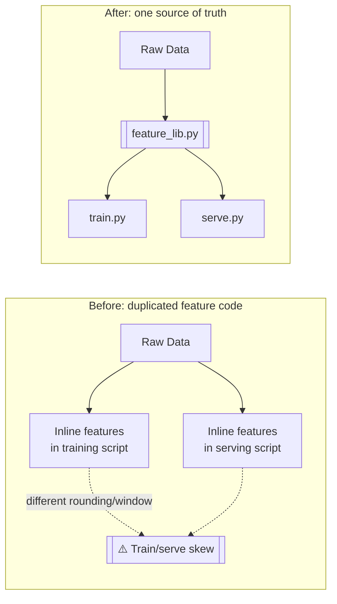

# Feature Engineering for AI Engineers — From Scratch

**Learn production feature engineering by building the systems that AI, ML,
and Data engineers actually deploy.**

> From an inline pandas script to a production feature platform.

This is not a collection of notes. It's a repository you run. Every concept
is built twice: the naive version first (so you feel *why* it breaks), then
the production version (so you learn the fix that engineers actually ship).

```
pandas script → shared feature library → sklearn pipeline →
point-in-time-correct joins → offline feature store → online store →
streaming features → embeddings → drift monitoring →
production feature platform
```

## Who this is for

AI/ML/Data engineers and data scientists moving into engineering. You should
know Python, pandas, and basic ML concepts (train/test split, what a model
is). You do **not** need to know feature stores, Kafka, Redis, or
point-in-time joins — that's what this repo teaches.

## The two levels

This repo currently scopes to Beginner → Intermediate. See
[`ROADMAP.md`](ROADMAP.md) for why Expert-tier topics are deliberately out
of scope for now.

| Level | You'll build | Status |
|---|---|---|
| 🟢 **Beginner** | shared feature library → sklearn pipelines → point-in-time joins → offline feature store | [see lessons](lessons/beginner) |
| 🟡 **Intermediate** | online store → streaming features → validation → versioning → embeddings → serving API | [see lessons](lessons/intermediate) |

Full curriculum and architecture evolution: [`ROADMAP.md`](ROADMAP.md).
What's actually built vs. planned right now: [`PROJECT_STATUS.md`](PROJECT_STATUS.md).

## The bug this repo starts with

Every feature engineering disaster starts the same way: the feature you
computed at training time isn't the feature you compute at serving time.
Lesson 00 makes you watch it happen — a naive re-implementation of "the same"
features produces different numbers for identical raw data — before showing
you the fix: one shared, tested, pure feature library used by both paths.



- **Before**: the training script and the serving script each hand-roll the
  "same" features. They drift — different null handling, different window
  boundaries — and predictions in production don't match what the model was
  trained on.
- **After**: both `train.py` and `serve.py` import the same
  `feature_lib.py`. There is exactly one implementation of every feature, so
  there is nothing left to drift.

## Running the current lesson

```bash
uv sync
uv run python lessons/beginner/00-foundations/code/generate_data.py
uv run python lessons/beginner/00-foundations/code/naive_train.py
uv run python lessons/beginner/00-foundations/code/naive_serve.py   # shows the skew
uv run python lessons/beginner/00-foundations/code/train.py
uv run python lessons/beginner/00-foundations/code/serve.py         # skew is gone
make test
```

## Contributing / extending

See [`CLAUDE.md`](CLAUDE.md) for the non-negotiable rules this repo is built
under (never ship a placeholder lesson, always run what you write, diagram
every architecture claim).
