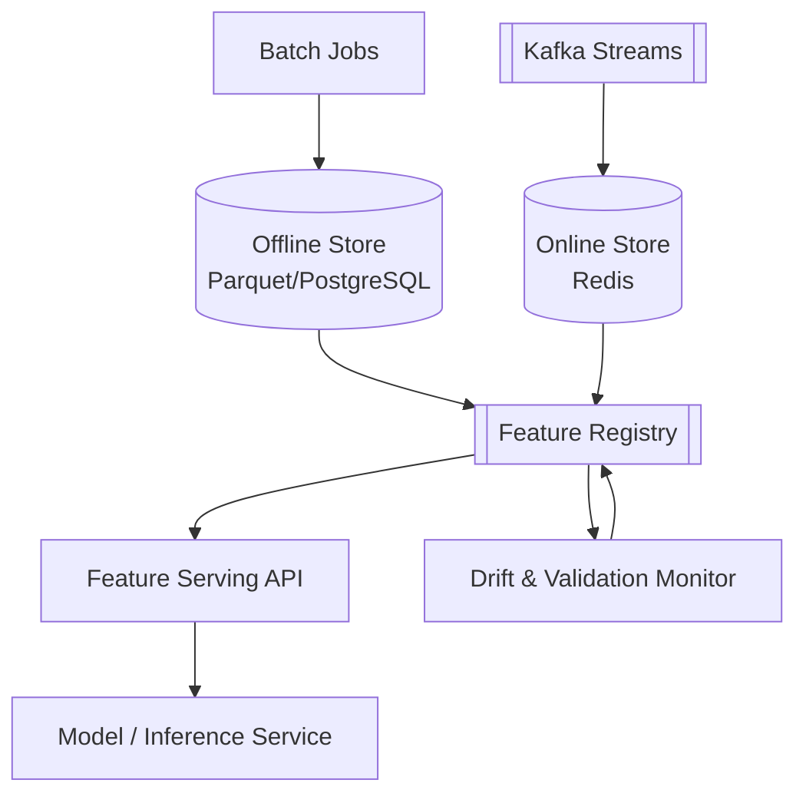

# Roadmap

This is the full curriculum. `PROJECT_STATUS.md` tracks what's actually
built today — this file is the destination.

This repo currently scopes to **Beginner → Intermediate**. Expert-level
topics (drift/decay, governance, cost/scale, RAG features, system design)
are a natural continuation but are explicitly out of scope until the
Beginner + Intermediate track is fully built and solid.

## Level progression

```
🟢 BEGINNER                    🟡 INTERMEDIATE
Foundations                      Online Store
   ↓                                ↓
Feature Functions                Streaming Features
   ↓                                ↓
Encoding & Scaling                Feature Validation
   ↓                                ↓
sklearn Pipelines                 Feature Versioning
   ↓                                ↓
Point-in-Time Correctness         Embeddings at Scale
   ↓                                ↓
Feature Store Basics               Feature Serving API
   ↓                                ↓
Docker & Reproducibility          Orchestration
                                     ↓
                                  Observability
```

## 🟢 Beginner

| # | Lesson | You build |
|---|---|---|
| 00 | Foundations | inline pandas features → shared `feature_lib`, fixing train/serve skew |
| 01 | Feature Functions & Testing | pure, unit-tested feature functions |
| 02 | Encoding & Scaling | one-hot vs. target encoding vs. embeddings; leakage from fitting on the full dataset |
| 03 | sklearn Pipelines | `ColumnTransformer`/`Pipeline`, fit on train only, serialize with `joblib` |
| 04 | Point-in-Time Correctness | as-of joins; a real target-leakage bug, found and fixed |
| 05 | Feature Store Basics | offline store on Parquet + PostgreSQL, feature registry |
| 06 | Docker & Reproducibility | containerize the feature job, pin dependencies |

## 🟡 Intermediate

| # | Lesson | You build |
|---|---|---|
| 07 | Online Store | Redis-backed low-latency serving, offline/online consistency |
| 08 | Streaming Features | Kafka consumer computing rolling-window aggregations |
| 09 | Feature Validation | schema + data-quality gates, fail fast on bad data |
| 10 | Feature Versioning | schema evolution, point-in-time feature versions |
| 11 | Embeddings at Scale | entity embedding tables, vector similarity features |
| 12 | Feature Serving API | FastAPI service unifying online + offline features for a model |
| 13 | Orchestration | DAG-based batch scheduling, backfills |
| 14 | Observability | freshness, null-rate, cardinality drift dashboards |

## 🔴 Expert (out of scope for now)

Not planned yet. Once Beginner + Intermediate are complete and solid, this
tier would cover data drift/model decay, a unified real-time platform,
governance, cost/scale, features for RAG/LLMs, and system design — see
"Architecture evolution" below for where the story would continue.

## Architecture evolution

The same system, `Loom`, evolves through Beginner + Intermediate:

```
v1  raw-script                 single script, features computed inline with pandas
v2  shared-feature-lib         pure feature functions, one source of truth for train + serve
v3  sklearn-pipeline           ColumnTransformer/Pipeline, fit only on train data
v4  point-in-time-join         as-of joins prevent target leakage from future data
v5  feature-store-offline      Parquet/PostgreSQL offline store + feature registry
v6  online-store               Redis online store, offline/online consistency
v7  streaming                  Kafka rolling-window aggregations computed in real time
v8  embeddings                 entity embedding tables, vector similarity features
v9  monitoring                 schema validation + drift detection gates (Lesson 14, Observability)
```

`v9` is the current target end state — a validated, observable, offline +
online feature platform. Anything beyond that (a full real-time capstone,
governance, RAG-specific features) is Expert-tier and out of scope for now.

## Target architecture (end of Intermediate)



- **Batch Jobs** compute historical, point-in-time-correct features into the
  **Offline Store** — used for training.
- **Kafka Streams** compute rolling features in real time into the
  **Online Store** — used for low-latency serving.
- The **Feature Registry** is the single source of truth for what a feature
  is (name, owner, dtype, lineage, version), regardless of which store
  materializes it.
- The **Feature Serving API** is the only thing a model talks to — it
  doesn't know or care whether a feature came from the offline or online
  path.
- The **Drift & Validation Monitor** watches both stores for schema
  violations and statistical drift, feeding back into the registry.

Embeddings, orchestration, and observability (Lessons 11, 13, 14) refine
this same picture rather than adding new boxes — see
`docs/architecture/intermediate/` once those lessons land.

## Career learning paths

See [`docs/learning-paths/`](docs/learning-paths) for tailored sequences
once they're drafted (AI Engineer, ML Engineer, Data Scientist → ML
Engineer, MLOps/Platform Engineer).
