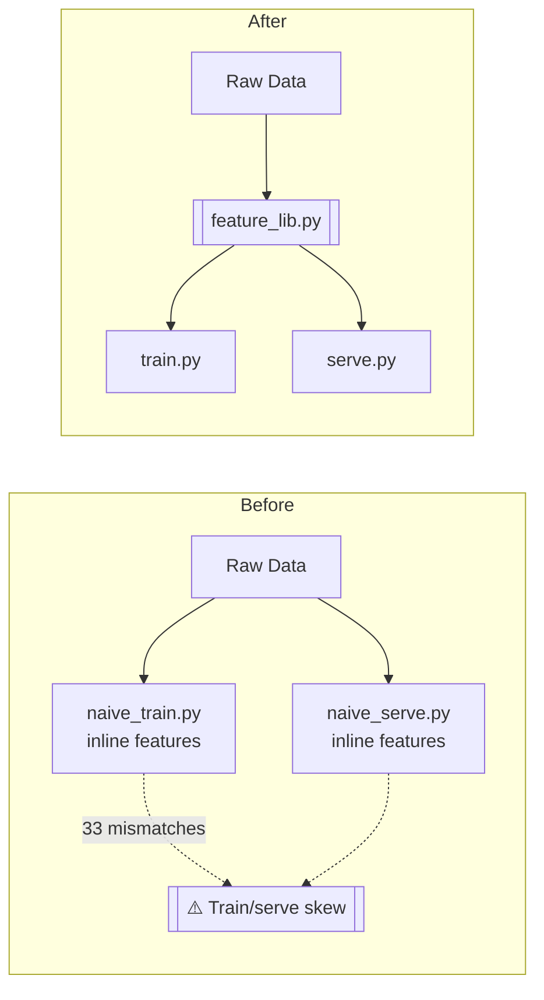

# 00 — Foundations

```
Level: 🟢 Beginner
Prerequisites: Python, pandas basics, what a train/test split is
Estimated difficulty: 1/5
You will learn: what a "feature" actually is, why train/serve skew happens,
  and the one-library fix that eliminates it
You will build: a synthetic customer dataset, two independent (and
  disagreeing) naive feature implementations, and a shared feature library
  that fixes them
```

## Problem

A "feature" is just a number computed from raw data — days since signup,
orders in the last 30 days, average order value. Nothing about that sounds
hard. The hard part is that in a real system, that number gets computed in
at least two places: once when you build a training set, and once when you
serve a live prediction. If those two computations aren't *identical*, your
model is scored on data that doesn't match what it was trained on. This is
called **train/serve skew**, and it's one of the most common — and most
silent — ways ML systems fail in production. Nothing crashes. The model
just quietly gets worse.

## Intuition

Think of a feature as a pure function: `raw_data -> value`. The engineering
problem isn't computing the value once — it's making sure *every* caller of
that function, no matter who wrote the calling code or when, gets the exact
same answer for the exact same input. If two people implement "orders in
the last 30 days" from a plain-English description, they will make
different, reasonable-sounding choices — is a boundary order included? What
does "average order value" mean for a customer with zero orders? Every one
of those choices is a place skew can creep in.

## Architecture

At this stage there's no service, no store, nothing to diagram in Mermaid —
just two ways of organizing the same script:

```
Before (this lesson's bug):
  raw data ──▶ inline feature code in naive_train.py ──▶ training matrix
  raw data ──▶ inline feature code in naive_serve.py ──▶ serving matrix
                     (different code, same intent, different answers)

After (this lesson's fix):
  raw data ──▶ feature_lib.py ──▶ train.py  ──▶ training matrix
                     │
                     └────────▶ serve.py  ──▶ serving matrix
                     (same code, so nothing can disagree)
```

## How It Works

Four features are computed for each customer, as of a fixed point in time
(`AS_OF_DATE`): `days_since_signup`, `is_weekend_signup`,
`orders_last_30d`, `avg_order_value`. Simple to describe, easy to
implement two different ways by accident.

## Naive Implementation

`code/naive_train.py` computes all four features inline, the way a training
notebook usually starts. Two choices, made without thinking too hard about
them:
- `orders_last_30d` uses a **strict** window: an order exactly 30 days
  before `AS_OF_DATE` does not count.
- A customer with zero orders gets `avg_order_value = 0.0`, because the
  training matrix is about to be fed into `LogisticRegression`, which can't
  handle `NaN`.

## Break It

`code/naive_serve.py` re-implements the same four features independently —
simulating a different engineer, working from a description rather than the
training code, building the serving path weeks later. It makes two
different, equally reasonable choices:
- `orders_last_30d` uses an **inclusive** window: an order exactly 30 days
  before `AS_OF_DATE` *does* count.
- A customer with zero orders gets `avg_order_value = NaN` — there's no
  sklearn matrix forcing a fill at serving time, so nobody added one.

Run them in order:

```bash
uv run python lessons/beginner/00-foundations/code/naive_train.py
uv run python lessons/beginner/00-foundations/code/naive_serve.py
```

## Observe It

`naive_serve.py` loads the feature matrix `naive_train.py` wrote, recomputes
its own version of the same features from the same raw data, and prints
every value where they disagree. On this repo's fixed synthetic dataset
that's **33 mismatches**: every zero-order customer's `avg_order_value`
(`0.0` vs `NaN`), and every customer with an order exactly on the 30-day
boundary — including customer `1`, whose data was deliberately constructed
to sit on that boundary — where `orders_last_30d` differs by exactly one.
This is a real, executed diff, not a hypothetical.

## Production Pattern

The fix is not "be more careful." It's structural: there is exactly **one**
implementation of each feature, imported by every caller. `code/feature_lib.py`
holds pure functions — same input, same output, always, with the
window/null-handling choices written down and explained in the docstring
instead of left implicit in two different files.

## Architecture After Fix



- **`feature_lib.py`** is the only place any feature is defined.
- **`train.py`** and **`serve.py`** both call `build_feature_matrix()` from
  it — neither one knows or cares that the other exists, but they can't
  disagree because they're running the same code.

## Implement It

```bash
uv run python lessons/beginner/00-foundations/code/train.py
uv run python lessons/beginner/00-foundations/code/serve.py
```

`serve.py` runs the same diff check `naive_serve.py` did. This time:
`No mismatches: train.py and serve.py agree on every feature, for every
customer, because both call feature_lib.build_feature_matrix.`

## Test It

```bash
make test
```

`test_foundations.py` covers this lesson's whole argument as executable
assertions, not prose:
- `test_naive_train_and_naive_serve_disagree` — proves the bug is real:
  the two naive implementations must disagree on `orders_last_30d` for
  customer 1 and `avg_order_value` for customer 2.
- `test_shared_feature_lib_eliminates_skew` — proves the fix works:
  rebuilding the feature matrix independently through `feature_lib`
  produces zero mismatches.
- `test_feature_lib_is_deterministic` and two boundary-value unit tests
  pin down the exact behavior `feature_lib` commits to.

## Scale It

This still doesn't scale, on purpose — that's what motivates the rest of
Beginner:
- Everything is in-memory pandas; there's no persistent store a real
  serving process could query without re-deriving from raw CSVs.
- There's no feature registry — nothing records *who* owns
  `avg_order_value`, what it means, or that its null-handling choice was
  deliberate.
- `AS_OF_DATE` is a single fixed point in time. A real system needs
  point-in-time-correct joins so that training data for an event in the
  past only sees data that existed *before* that event — Lesson 04.
- Encoding categorical data and scaling numeric data safely (fit only on
  train, never on the full dataset) isn't covered yet — Lessons 02–03.

## Common Mistakes

- **Assuming a "shared spec doc" is enough.** It isn't — the naive scripts
  in this lesson were each "correct" relative to a plausible reading of
  "count orders in the last 30 days." Docs drift; code that's actually
  shared can't.
- **Filling `NaN` inconsistently at the edges of a pipeline.** The
  `avg_order_value` bug here is exactly this: one path fills nulls because
  a downstream library forces it to, the other doesn't because nothing
  forces it — and the fill value becomes part of the feature's definition
  by accident.
- **Treating "the model trains fine" as proof the features are correct.**
  `naive_train.py`'s accuracy number (0.55–0.57 on random labels, as
  expected) says nothing about whether serving will reproduce those
  features. Skew is invisible in training-time metrics.

## Interview Mode

- *"What is train/serve skew, and how would you detect it in a system you
  didn't build?"* — Compare feature values computed by the training
  pipeline against the same raw inputs run through the serving path; any
  disagreement is skew. In production, you'd log serving-time feature
  values and periodically diff them against a batch recomputation.
- *"Why is `NaN` vs `0.0` for 'no orders' a design decision, not a bug fix
  choice?"* — Because it changes what the feature *means* to the model:
  `0.0` says "this customer spent nothing," `NaN` says "we don't know."
  Whichever you pick, every consumer of the feature needs to agree.
- *"Why not just have serving call the same training code directly?"* —
  Sometimes you can (this lesson's fix is exactly that, in miniature). At
  scale, training runs in batch over historical data and serving runs
  per-request in real time — they need the same feature *definitions* but
  often different execution paths, which is why Lesson 05 introduces a
  feature store instead of a shared Python import.

## Challenge

Add a fifth feature, `days_since_last_order`, to `feature_lib.py` — for a
customer with no orders, decide (and document, the way `avg_order_value`
is documented) what it should return, then add a unit test pinning that
choice down the way `test_avg_order_value_of_no_orders_is_zero_not_nan`
does.

## Summary

A feature is a pure function of raw data. Train/serve skew happens when
two different implementations of "the same" function exist. The fix isn't
discipline — it's deleting the second implementation and importing the
first one.

## Next Lesson

**01 — Feature Functions & Testing**: `feature_lib.py` has four features and
one test file. The next lesson looks at what breaks when a real feature
library has fifty features, multiple contributors, and needs tests that
scale with it.
